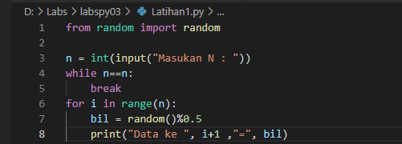
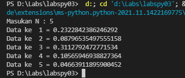
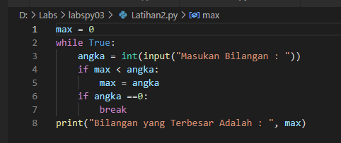
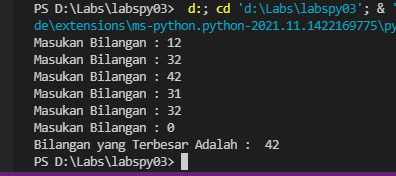
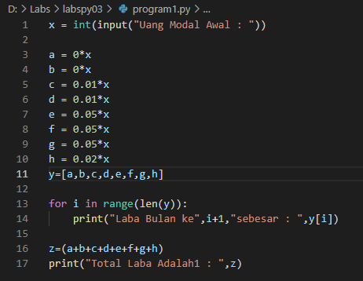
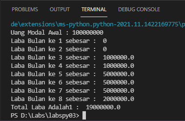

# labspy03
## Tugas Praktikum 3

## Latihan1.py
### Menampilkan n Bilangan Acak yang Lebih Kecil Dari 0.5
#### Dengan cara menginput N akan muncul beberapa nilai acak dari angka di bawah 0.5

### Berikut Outputnya

## Latihan2.py
### Menentukan Bilangan Terbesar dari beberapa bilangan dan program berhenti jika menginput 0
#### Dengan menginput beberapa angka lalu program akan berhenti jika menginput angka 0 dan memberikan hasil angka yang terbesar

### Berikut Outputnya

## Program1.py
### Menentukan Laba Investasi dengan skenario yang sudah di tentukan
#### Dengan Menginput Modal Awal senilai 100.000.000 program akan menghitung berapa laba perbulan sesuai skenario dan total nya

### Berikut Outputnya

